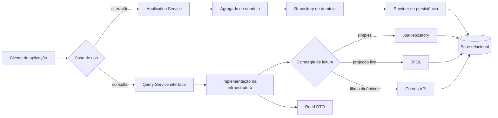

# Mapa mental: implementação de CQRS

Este guia resume a implementação de CQRS no microsserviço `ordering`. Use-o
como referência para identificar contratos, filtros, modelos de leitura,
implementações de consulta, APIs e testes em projetos futuros.

## Visão geral

O projeto usa CQRS em nível de aplicação. O lado de leitura possui contratos e
implementações próprios, mas ainda consulta a mesma base relacional usada pelo
lado de escrita. Não existem `Command`, `CommandHandler`, query bus, ou banco
de leitura separados neste módulo.

```mermaid
mindmap
  root((CQRS - ordering))
    Estratégia
      CQRS em nível de aplicação
      Mesma base relacional
      Sem Command Handler formal
      Sem Query Bus
    Lado de escrita
      Application Services
        CustomerManagementApplicationService
          create
          update
          archive
          changeEmail
        OrderManagementApplicationService
          cancel
          markAsPaid
          markAsReady
        ShoppingCartManagementApplicationService
          addItem
          createNew
          removeItem
          empty
          delete
      Domínio
        Customers
        Orders
        ShoppingCarts
        Agregados
      Transação
        '@Transactional'
        Regras de negócio
        Persistência do agregado
    Lado de leitura
      Contratos
        ShoppingCartQueryService
          findById
          findByCustomerId
        CustomerQueryService
          findById
          filter
        OrderQueryService
          findById
          filter
      Filtros
        PageFilter
          page
          size
        SortablePageFilter<T>
          sortByProperty
          sortDirection
          defaults abstratos
        CustomerFilter
        OrderFilter
      Read Models
        ShoppingCartOutput
        CustomerOutput
        CustomerSummaryOutput
        OrderDetailOutput
        OrderSummaryOutput
        DTOs aninhados
      Implementações
        ShoppingCartQueryServiceImpl
          JpaRepository
          Query derivada
          Mapper
        CustomerQueryServiceImpl
          Projeção JPQL
          Criteria API
          Paginação
        OrderQueryServiceImpl
          EntityGraph
          Criteria API
          Conversão TSID
          Paginação
      Transação
        '@Transactional(readOnly = true)'
    Testes
      '@SpringBootTest'
      '@Transactional'
      Injeção pelo contrato
      AssertJ
      Filtros
      Paginação
      Ordenação
```

## Fluxo mental principal

O lado de escrita altera agregados. O lado de leitura consulta diretamente as
entidades de persistência e retorna DTOs próprios para cada caso de uso.



## Contratos de consulta

As interfaces ficam na camada de aplicação. A aplicação depende do contrato, e
não da implementação JPA.

| Contexto | Interface | Operações | Retorno |
| --- | --- | --- | --- |
| Carrinho | `ShoppingCartQueryService` | `findById`, `findByCustomerId` | `ShoppingCartOutput` |
| Cliente | `CustomerQueryService` | `findById`, `filter` | `CustomerOutput` ou `Page<CustomerSummaryOutput>` |
| Pedido | `OrderQueryService` | `findById`, `filter` | `OrderDetailOutput` ou `Page<OrderSummaryOutput>` |

Arquivos dos contratos:

- [`ShoppingCartQueryService.java`](../microservices/ordering/src/main/java/com/algaworks/algashop/ordering/application/shoppingcart/query/ShoppingCartQueryService.java)
- [`CustomerQueryService.java`](../microservices/ordering/src/main/java/com/algaworks/algashop/ordering/application/customer/query/CustomerQueryService.java)
- [`OrderQueryService.java`](../microservices/ordering/src/main/java/com/algaworks/algashop/ordering/application/order/query/OrderQueryService.java)

Esses contratos funcionam como APIs Java internas. Neste checkout, o módulo
`ordering` não possui controllers REST para expor essas consultas por HTTP.

## Modelos de leitura

Os retornos não são agregados do domínio. São DTOs desenhados para a resposta
de cada consulta:

- Carrinho: `ShoppingCartOutput` e `ShoppingCartItemOutput`.
- Cliente: `CustomerOutput` para detalhe e `CustomerSummaryOutput` para lista.
- Pedido: `OrderDetailOutput` para detalhe e `OrderSummaryOutput` para lista.
- Dados compostos: `CustomerMinimalOutput`, `BillingData`, `ShippingData`,
  `RecipientData`, e `AddressData`.

Essa separação permite que uma tela receba somente os campos necessários e
evita expor diretamente entidades JPA ou objetos ricos do domínio.

## Paginação e filtros

[`PageFilter.java`](../microservices/ordering/src/main/java/com/algaworks/algashop/ordering/application/utility/PageFilter.java)
centraliza `page` e `size`, com tamanho padrão de 15 registros.

[`SortablePageFilter.java`](../microservices/ordering/src/main/java/com/algaworks/algashop/ordering/application/utility/SortablePageFilter.java)
é a classe abstrata genérica. Ela adiciona `sortByProperty` e
`sortDirection`, além de exigir que cada filtro defina seus valores padrão.

Exemplos:

- `CustomerFilter` filtra por `firstName` e `email`.
- `OrderFilter` filtra por cliente, status, identificador, datas e valores.
- Os enums de ordenação convertem opções controladas em nomes de propriedades
  JPA. Não se deve enviar diretamente um nome de propriedade recebido do
  cliente para `root.get(...)`.

## Implementações de consulta

### Carrinho

[`ShoppingCartQueryServiceImpl.java`](../microservices/ordering/src/main/java/com/algaworks/algashop/ordering/infrastructure/persistence/shoppingcart/ShoppingCartQueryServiceImpl.java)
usa a implementação mais simples:

```text
findById(UUID)
  -> ShoppingCartPersistenceEntityRepository.findById(...)
  -> Mapper.convert(...)
  -> ShoppingCartOutput
```

Para localizar pelo cliente, usa o método derivado
`findByCustomer_Id(UUID)`. Quando não encontra o carrinho, lança
`ShoppingCartNotFoundException`.

### Cliente

[`CustomerQueryServiceImpl.java`](../microservices/ordering/src/main/java/com/algaworks/algashop/ordering/infrastructure/persistence/customer/CustomerQueryServiceImpl.java)
usa `EntityManager` porque possui filtros dinâmicos.

Para o detalhe, usa uma projeção JPQL diretamente para `CustomerOutput`:

```java
SELECT new CustomerOutput(...)
```

Para a listagem, executa duas consultas com os mesmos predicados:

1. Conta o total de registros.
2. Busca a página de `CustomerSummaryOutput`.

A consulta aplica filtros case-insensitive por nome e e-mail, ordenação,
offset, limite, e retorna `PageImpl<CustomerSummaryOutput>`.

### Pedido

[`OrderQueryServiceImpl.java`](../microservices/ordering/src/main/java/com/algaworks/algashop/ordering/infrastructure/persistence/order/OrderQueryServiceImpl.java)
combina duas estratégias.

Para o detalhe:

```text
String público
  -> OrderId
  -> Long persistido
  -> repository.findById(...)
  -> Mapper
  -> OrderDetailOutput
```

O `findById` do repositório usa `@EntityGraph` para carregar cliente e itens.

Para a listagem, a Criteria API monta uma projeção de
`OrderSummaryOutput`, incluindo `CustomerMinimalOutput`, e aplica filtros por:

- `customerId`;
- `status`;
- `orderId`;
- intervalo de `placedAt`;
- intervalo de `totalAmount`;
- ordenação e paginação.

Um identificador inválido é convertido em uma consulta que retorna uma página
vazia, em vez de interromper a listagem.

## Mapper e conversões

[`Mapper.java`](../microservices/ordering/src/main/java/com/algaworks/algashop/ordering/application/utility/Mapper.java)
é uma abstração pequena para conversão de objetos:

```java
<T> T convert(Object object, Class<T> destinationType);
```

[`ModelMapperConfig.java`](../microservices/ordering/src/main/java/com/algaworks/algashop/ordering/infrastructure/utility/modelmapper/ModelMapperConfig.java)
fornece essa interface usando ModelMapper e configura conversões específicas:

- `FullName` para primeiro e último nome;
- `BirthDate` para `LocalDate`;
- `Long` para string TSID;
- entidades de pedido para DTOs detalhados.

Quando a consulta já possui uma projeção JPQL ou Criteria, ela constrói o DTO
diretamente e não precisa passar pelo mapper.

## Lado de escrita

O projeto não modela cada operação como uma classe `Command`. As alterações
ficam em serviços de aplicação transacionais:

- [`CustomerManagementApplicationService.java`](../microservices/ordering/src/main/java/com/algaworks/algashop/ordering/application/customer/management/CustomerManagementApplicationService.java)
  executa criação, atualização, arquivamento, e troca de e-mail.
- [`OrderManagementApplicationService.java`](../microservices/ordering/src/main/java/com/algaworks/algashop/ordering/application/order/management/OrderManagementApplicationService.java)
  cancela, paga, e marca pedidos como prontos.
- [`ShoppingCartManagementApplicationService.java`](../microservices/ordering/src/main/java/com/algaworks/algashop/ordering/application/shoppingcart/management/ShoppingCartManagementApplicationService.java)
  cria, altera, esvazia, e remove carrinhos.

Esses serviços carregam o agregado pelos ports de domínio, executam métodos de
negócio, e salvam novamente:

```text
Application Service
  -> Customers / Orders / ShoppingCarts
  -> Agregado de domínio
  -> regra de negócio
  -> Repository de domínio
  -> Provider de persistência
```

Os ports de domínio são `Customers`, `Orders`, e `ShoppingCarts`. Eles não são
os contratos de consulta; representam o acesso aos agregados usados pelo lado
de escrita.

## APIs utilizadas

### Spring

- `@Service` e `@Component` registram implementações como beans.
- `@RequiredArgsConstructor` gera a injeção por construtor.
- `@Transactional` delimita operações de escrita.
- `@Transactional(readOnly = true)` marca o lado de leitura.

### Spring Data JPA

- `JpaRepository` fornece `findById`, `existsById`, `count`, e operações de
  persistência.
- Queries derivadas, como `findByCustomer_Id`, expressam filtros simples pelo
  nome do método.
- `@Query` declara JPQL explícita.
- `@EntityGraph` define associações carregadas junto com a consulta.
- `Page`, `PageRequest`, e `PageImpl` representam paginação.

### Jakarta Persistence

- `EntityManager` cria consultas programáticas.
- `TypedQuery` executa consultas tipadas.
- `CriteriaBuilder`, `CriteriaQuery`, `Root`, e `Predicate` montam filtros
  dinâmicos.
- `builder.construct` cria DTOs diretamente no resultado da consulta.
- `setFirstResult` e `setMaxResults` aplicam offset e limite.

### Testes

- `@SpringBootTest` inicializa o contexto completo.
- `@Transactional` mantém o teste isolado transacionalmente.
- `@Autowired` injeta o contrato que será testado.
- AssertJ verifica DTOs, páginas, filtros, e ordenação.

## Teste de referência

[`ShoppingCartQueryServiceIT.java`](../microservices/ordering/src/test/java/com/algaworks/algashop/ordering/application/shoppingcart/query/ShoppingCartQueryServiceIT.java)
mostra o fluxo completo:

```text
@SpringBootTest + @Transactional
  -> injeta ShoppingCartQueryService
  -> cria Customer pelo domínio
  -> persiste Customer e ShoppingCart
  -> chama o contrato de consulta
  -> valida ShoppingCartOutput
```

Os testes de cliente e pedido ampliam o mesmo padrão para paginação, filtros,
ordenação, projeções e páginas vazias:

- [`CustomerQueryServiceIT.java`](../microservices/ordering/src/test/java/com/algaworks/algashop/ordering/application/customer/query/CustomerQueryServiceIT.java)
- [`OrderQueryServiceIT.java`](../microservices/ordering/src/test/java/com/algaworks/algashop/ordering/application/order/query/OrderQueryServiceIT.java)

## Receita para novos projetos

Siga esta sequência para criar um novo caso de consulta:

1. Identifique o caso de uso de leitura.
2. Defina uma interface na camada de aplicação.
3. Modele um DTO de detalhe ou resumo para a resposta.
4. Crie um filtro próprio, herdando paginação e ordenação quando necessário.
5. Implemente o contrato na infraestrutura.
6. Use `JpaRepository` para consultas simples.
7. Use projeção JPQL para DTOs fixos.
8. Use Criteria API para filtros combináveis e ordenação dinâmica.
9. Marque o serviço com `@Transactional(readOnly = true)`.
10. Valide o contrato com um teste de integração.

Mantenha estas regras como referência:

- Não retorne agregados do domínio em consultas.
- Não misture regras de negócio de escrita no query service.
- Não aceite propriedades de ordenação sem uma lista controlada.
- Reaplique exatamente os mesmos predicados na consulta de contagem e na
  consulta paginada.
- Use o lado de escrita para alterar estado e o lado de leitura para montar
  respostas.

## Checklist

- [ ] Existe uma interface de consulta na camada de aplicação.
- [ ] A implementação está isolada na infraestrutura.
- [ ] O retorno é um DTO de leitura, não um agregado.
- [ ] O filtro limita propriedades de ordenação válidas.
- [ ] Consultas de listagem possuem paginação e contagem coerentes.
- [ ] O serviço de leitura usa `readOnly = true`.
- [ ] O lado de escrita permanece transacional.
- [ ] Há teste pelo contrato da consulta.
- [ ] O projeto documenta se o CQRS usa ou não banco de leitura separado.
