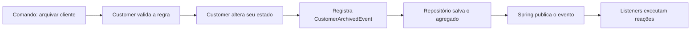

# Domain Events: guia de mentoria

Este guia ensina Domain Events a partir da implementação do Algashop. A meta
não é apenas copiar uma estrutura, mas entender o raciocínio que permite
aplicar o padrão em outros projetos.

Use o [mapa mental de Domain Events](domain-events-mind-map.md) como referência
rápida depois de estudar este guia.

## A ideia em uma frase

> Um Domain Event registra que algo relevante já aconteceu no domínio e
> permite que outras partes da aplicação reajam sem acoplar essas reações ao
> agregado.

Guarde três palavras:

1. **Fato:** algo realmente aconteceu.
2. **Passado:** o nome descreve o fato consumado.
3. **Reação:** outros componentes podem responder ao fato.

No Algashop, `OrderReadyEvent` significa “o pedido ficou pronto”. Ele não
pede que alguém prepare o pedido. Ele informa um fato que já ocorreu.

## Comece pelo problema, não pelo padrão

Imagine que, quando um pedido fica pronto, o sistema precisa:

- adicionar pontos de fidelidade ao cliente;
- enviar uma notificação;
- registrar uma métrica;
- futuramente, avisar outro microsserviço.

Uma solução direta coloca tudo dentro de `Order.ready()`:

```java
public void ready() {
    this.status = OrderStatus.READY;
    loyaltyService.addPoints(customerId);
    notificationService.notify(customerId);
    metricsService.recordReadyOrder(id);
}
```

Essa solução cria problemas:

- `Order` passa a conhecer serviços que não fazem parte de sua regra central;
- cada nova reação exige alterar o agregado;
- testar a transição de estado exige preparar vários mocks;
- uma falha de notificação pode interferir na regra do pedido;
- o modelo deixa de expressar somente o negócio do pedido.

Domain Events separam duas responsabilidades:

- o agregado decide e registra **o que aconteceu**;
- os listeners decidem **o que fazer porque isso aconteceu**.

```java
public void ready() {
    this.status = OrderStatus.READY;
    publishDomainEvent(
            new OrderReadyEvent(id, customerId, OffsetDateTime.now())
    );
}
```

O agregado conhece o fato de negócio, mas não conhece pontos, e-mail,
métricas, Spring, ou broker.

## O modelo mental

Pense no evento como um comprovante emitido pelo domínio:

- o agregado executa uma operação válida;
- a operação muda o estado;
- o agregado emite um comprovante imutável do que ocorreu;
- outros componentes leem o comprovante e reagem.

O comprovante não executa a reação. `CustomerArchivedEvent` não anonimiza o
cliente. O método `Customer.archive()` anonimiza o cliente e, depois, registra
que o arquivamento aconteceu.



## Evento não é comando

Essa distinção evita muitos erros.

| Comando | Evento |
| --- | --- |
| Expressa uma intenção | Expressa um fato |
| Pode ser recusado | Já aconteceu |
| Usa verbo no imperativo | Usa verbo no passado |
| `ArchiveCustomer` | `CustomerArchivedEvent` |
| Normalmente tem um responsável | Pode ter vários consumidores |

Se o nome parece uma ordem, provavelmente você modelou um comando. Prefira
`OrderPaidEvent` a `ProcessOrderPaymentEvent`.

## As peças no Algashop

### O agregado

`Customer`, `Order`, e `ShoppingCart` são raízes de agregado. Elas protegem
regras, alteram estado, e registram os fatos relevantes.

No cadastro de um cliente, o próprio `Customer` registra o evento:

```java
customer.publishDomainEvent(
        new CustomerRegisteredEvent(
                customer.id(),
                customer.registeredAt(),
                customer.fullName(),
                customer.email()
        )
);
```

Isso garante que não existe um cliente novo criado por esse fluxo sem o evento
correspondente. A criação e o registro do fato permanecem juntos.

### O evento

O projeto usa `record`, uma boa escolha para dados imutáveis:

```java
public record CustomerArchivedEvent(
        CustomerId customerId,
        OffsetDateTime archivedAt
) {
}
```

Inclua no evento os dados que descrevem o fato no momento em que ocorreu. Não
inclua serviços, repositórios, ou entidades JPA.

### A fonte de eventos

`AbstractEventSourceEntity` funciona como uma caixa de saída temporária do
agregado:

```java
public abstract class AbstractEventSourceEntity
        implements DomainEventSource {

    private final List<Object> domainEvents = new ArrayList<>();

    protected void publishDomainEvent(Object event) {
        domainEvents.add(Objects.requireNonNull(event));
    }

    public List<Object> domainEvents() {
        return Collections.unmodifiableList(domainEvents);
    }

    public void clearDomainEvents() {
        domainEvents.clear();
    }
}
```

Apesar do nome `publishDomainEvent`, esse método ainda não entrega o evento a
um listener. Ele apenas adiciona o evento à coleção de pendências.

Essa distinção é essencial:

- **registrar:** colocar o evento na coleção do agregado;
- **publicar:** entregar o evento ao mecanismo que chama os consumidores.

### A ponte de persistência

O domínio do Algashop não depende do Spring. Por isso, o assembler copia os
eventos para a entidade JPA:

```java
customerPersistenceEntity.addEvents(customer.domainEvents());
```

A entidade JPA estende `AbstractAggregateRoot`, do Spring Data, e registra cada
evento com `registerEvent`. Quando o repositório executa `saveAndFlush`, o
Spring Data publica os eventos para os listeners.

Depois, o provider limpa os eventos pendentes do objeto de domínio:

```java
aggregateRoot.clearDomainEvents();
```

Sem a cópia, os eventos nunca chegam ao Spring. Sem a limpeza, um salvamento
futuro pode publicar o mesmo fato novamente.

### O listener

O listener reage ao fato:

```java
@EventListener
public void listen(OrderReadyEvent event) {
    customerLoyaltyPointsApplicationService.addLoyaltyPoints(
            event.customerId().value(),
            event.orderId().toString()
    );
}
```

Mantenha o listener pequeno. Ele recebe, extrai os dados necessários, e delega
o trabalho a um serviço de aplicação.

## O fluxo completo, sem mágica

Quando `Order.ready()` é chamado, acontece esta sequência:

1. `Order` valida se a transição é permitida.
2. `Order` altera seu estado para pronto.
3. `Order` cria um `OrderReadyEvent`.
4. `AbstractEventSourceEntity` guarda o evento na lista.
5. O serviço de aplicação entrega `Order` ao repositório de domínio.
6. O assembler copia estado e eventos para a entidade JPA.
7. O repositório Spring Data salva a entidade.
8. Spring Data publica os eventos registrados.
9. Os métodos `@EventListener` compatíveis são executados.
10. A lista de eventos pendentes do agregado é limpa.

Se você consegue explicar essas dez etapas sem consultar o código, já
entendeu a mecânica usada pelo projeto.

## Onde entra o `ApplicationEventPublisher`

`ApplicationEventPublisher` é a API do Spring para publicar um objeto como
evento dentro da aplicação:

```java
applicationEventPublisher.publishEvent(orderReadyEvent);
```

No `CustomerEventListenerIT`, ele é usado diretamente para testar apenas a
ligação entre o Spring e o listener. O teste pula agregado, assembler,
persistência, e limpeza dos eventos.

Isso é útil porque responde a uma pergunta específica:

> Quando este evento é publicado no Spring, o listener correto reage?

O teste não responde a esta outra pergunta:

> Quando o caso de uso altera e salva o agregado, o evento percorre todo o
> caminho até o listener?

Para a segunda pergunta, você precisa de um teste do fluxo completo.

Evite injetar `ApplicationEventPublisher` no agregado. Isso acopla o modelo ao
Spring e permite publicar antes de a persistência ter sucesso. No Algashop, o
agregado apenas registra o evento, e a infraestrutura cuida da publicação.

## A parte delicada: transação

Publicar um evento não significa que a transação foi confirmada.
`saveAndFlush` envia alterações ao banco, mas ainda pode ocorrer rollback.

Com `@EventListener`, o listener normalmente executa de forma síncrona durante
a publicação. Se ele falhar, a exceção pode voltar ao fluxo principal.

Use `@TransactionalEventListener(phase = AFTER_COMMIT)` quando a reação só
fizer sentido depois da confirmação da transação:

```java
@TransactionalEventListener(phase = TransactionPhase.AFTER_COMMIT)
public void listen(CustomerRegisteredEvent event) {
    notificationService.notifyNewRegistration(event.customerId());
}
```

Mesmo assim, Spring Events funciona dentro do processo atual. Se a aplicação
parar depois do commit e antes da reação, o evento pode ser perdido. Para
entrega durável ou comunicação entre microsserviços, use Transactional
Outbox e um broker.

## Como decidir se algo merece um evento

Faça estas perguntas:

1. Isso representa um fato relevante para o negócio?
2. Outra parte da aplicação precisa reagir a esse fato?
3. A reação não pertence à responsabilidade central do agregado?
4. O fato merece aparecer na linguagem usada pelo time e pelos especialistas?

Se a resposta for “sim” para a maioria, um Domain Event pode ajudar.

Não crie um evento para toda alteração de atributo.
`CustomerEmailChangedEvent` só faz sentido se essa mudança provocar uma
reação relevante. Domain Events não são logs automáticos de setters.

## Como modelar um bom evento

Siga esta receita:

1. Escreva o fato em linguagem de negócio: “o pedido ficou pronto”.
2. Transforme a frase em um nome no passado: `OrderReadyEvent`.
3. Identifique quem produziu o fato: `orderId`.
4. Inclua dados necessários para correlação: `customerId`.
5. Registre quando ocorreu: `readyAt`.
6. Remova qualquer comportamento ou dependência de infraestrutura.

Evite eventos genéricos como `EntityUpdatedEvent`. Eles escondem a intenção
do negócio e forçam os consumidores a descobrir o que realmente mudou.

## Como testar sem confundir responsabilidades

Use três níveis de teste.

### 1. Teste do agregado

Pergunta: a regra registra o evento correto?

```java
customer.archive();

assertThat(customer.domainEvents())
        .contains(new CustomerArchivedEvent(
                customer.id(), customer.archivedAt()
        ));
```

Esse teste é rápido e não inicia o Spring.

### 2. Teste do listener

Pergunta: quando o Spring publica o evento, a reação correta acontece?

```java
applicationEventPublisher.publishEvent(event);

verify(customerEventListener).listen(any(OrderReadyEvent.class));
verify(loyaltyPointsService).addLoyaltyPoints(any(), any());
```

Esse é o papel de `CustomerEventListenerIT`.

### 3. Teste do fluxo completo

Pergunta: o caso de uso registra, salva, publica, consome, e limpa o evento?

Execute o caso de uso pela entrada real da aplicação e observe a reação
final. Esse teste protege a ponte entre o domínio e o Spring Data.

## Erros comuns

### Publicar o evento no controller

O controller não deve decidir quais fatos o domínio produziu. Essa decisão
pertence ao agregado.

### Tratar evento como comando

Um listener não deve receber `ArchiveCustomerEvent` para decidir se arquiva o
cliente. Isso ainda é uma intenção. Use um caso de uso ou comando.

### Colocar toda a regra no listener

O listener coordena a reação. As invariantes continuam no agregado ou em um
serviço de domínio.

### Consultar sempre o estado atual

O estado pode mudar entre a produção e o consumo. Inclua no evento os valores
históricos necessários para interpretar o fato.

### Acreditar que Spring Events é mensageria durável

`ApplicationEventPublisher` publica em memória. Ele não substitui Kafka,
RabbitMQ, uma Outbox, ou garantias de entrega.

### Ignorar duplicidade

Em integrações, o mesmo evento pode chegar mais de uma vez. Operações como
adicionar pontos ou cobrar um pagamento precisam de idempotência.

## Exercício guiado

Implemente um evento para a seguinte regra:

> Quando um carrinho é esvaziado, a aplicação precisa registrar uma métrica.

Siga estas etapas:

1. Encontre o método que esvazia `ShoppingCart`.
2. Confirme que ele altera o estado antes de registrar o fato.
3. Modele ou revise `ShoppingCartEmptiedEvent`.
4. Inclua `shoppingCartId`, `customerId`, e `emptiedAt`.
5. Registre o evento dentro do agregado.
6. Crie um listener que delega para um serviço de métricas.
7. Teste que o agregado contém o evento.
8. Teste o listener usando `ApplicationEventPublisher`.
9. Teste pelo repositório para validar o fluxo completo.

Ao terminar, explique por que o serviço de métricas não deve ser chamado
dentro de `ShoppingCart`. Se a resposta for “porque a métrica é uma reação
ao fato, e não uma invariante do carrinho”, você entendeu o conceito.

## Revisão para fixação

Responda sem consultar as seções anteriores:

1. Qual é a diferença entre comando e evento?
2. Quem decide que um Domain Event aconteceu?
3. Qual é a diferença entre registrar e publicar um evento?
4. Por que o agregado não recebe `ApplicationEventPublisher`?
5. O que `AbstractEventSourceEntity` armazena?
6. Qual é o papel de `AbstractAggregateRoot` na entidade JPA?
7. O que `CustomerEventListenerIT` testa e o que ele não testa?
8. Por que `saveAndFlush` não garante que o listener execute após o commit?
9. Quando usar `@TransactionalEventListener(AFTER_COMMIT)`?
10. Quando Spring Events deixa de ser suficiente?

## Resumo de bolso

- Um comando expressa intenção; um evento expressa um fato.
- O agregado executa a regra, muda o estado, e registra o evento.
- O evento é imutável, usa nome no passado, e carrega dados do fato.
- `AbstractEventSourceEntity` guarda eventos pendentes no domínio.
- O assembler transfere os eventos para a entidade JPA.
- `AbstractAggregateRoot` integra a publicação ao repositório Spring Data.
- `@EventListener` reage ao evento e delega o trabalho.
- `ApplicationEventPublisher` publica diretamente no Spring e ajuda a testar
  listeners isoladamente.
- `saveAndFlush` não significa commit.
- Spring Events não oferece entrega durável entre microsserviços.

Quando estiver em dúvida, volte à pergunta central:

> Qual fato de negócio aconteceu, e quem precisa reagir a ele?
