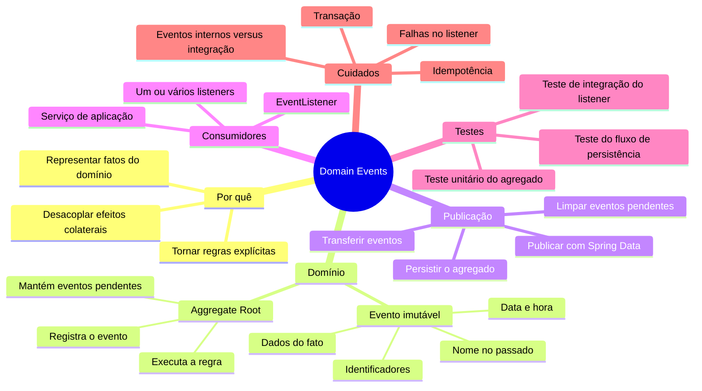
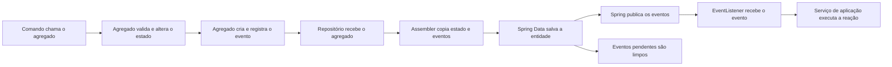

# Mapa mental: implementação de Domain Events

Este guia resume uma implementação de Domain Events com DDD, Java, Spring Data
JPA, e Spring Events. Ele usa o microsserviço `ordering` deste projeto como
referência e serve como roteiro para projetos futuros.

## Visão geral



## Fluxo desta implementação



No projeto, as responsabilidades estão distribuídas assim:

- `DomainEventSource` expõe os eventos pendentes e permite limpá-los.
- `AbstractEventSourceEntity` mantém a lista e oferece
  `publishDomainEvent` para as subclasses.
- `AggregateRoot<ID>` identifica os agregados que produzem eventos.
- `Customer`, `Order`, e `ShoppingCart` registram eventos durante operações de
  negócio.
- Os eventos são `record`s imutáveis, como `CustomerRegisteredEvent` e
  `OrderReadyEvent`.
- O assembler copia `aggregate.domainEvents()` para a entidade de persistência.
- A entidade JPA estende `AbstractAggregateRoot` e registra os eventos no Spring
  Data.
- O `saveAndFlush` do repositório dispara a publicação.
- Classes como `CustomerEventListener` recebem os eventos com `@EventListener`.

## Anatomia de um Domain Event

Modele o evento como um fato que já aconteceu. Use um nome no passado e inclua
somente os dados necessários para compreender e processar esse fato.

```java
public record OrderReadyEvent(
        OrderId orderId,
        CustomerId customerId,
        OffsetDateTime readyAt
) {
}
```

Um bom evento contém:

- um nome de negócio, como `OrderReadyEvent`;
- o identificador do agregado que produziu o fato;
- os identificadores necessários para correlacionar entidades;
- a data e hora em que o fato ocorreu;
- valores relevantes do momento do evento, quando o consumidor não deve
  consultar um estado que pode mudar.

Não coloque serviços, repositórios, entidades JPA, ou comportamento
mutável no evento.

## Implementação passo a passo

### 1. Crie o contrato da fonte de eventos

```java
public interface DomainEventSource {
    List<Object> domainEvents();
    void clearDomainEvents();
}
```

### 2. Armazene os eventos no modelo de domínio

```java
public abstract class AbstractEventSourceEntity
        implements DomainEventSource {

    private final List<Object> domainEvents = new ArrayList<>();

    protected void publishDomainEvent(Object event) {
        domainEvents.add(Objects.requireNonNull(event));
    }

    @Override
    public List<Object> domainEvents() {
        return Collections.unmodifiableList(domainEvents);
    }

    @Override
    public void clearDomainEvents() {
        domainEvents.clear();
    }
}
```

Retorne uma coleção não modificável para impedir que código externo
altere a fila do agregado.

### 3. Registre o evento junto com a mudança de estado

```java
public void ready() {
    // Valide as invariantes e altere o estado primeiro.
    this.status = OrderStatus.READY;
    publishDomainEvent(
            new OrderReadyEvent(id, customerId, OffsetDateTime.now())
    );
}
```

O próprio agregado registra o evento. Assim, a regra e o fato permanecem
atômicos no modelo, e a camada de aplicação não precisa lembrar de
publicá-lo.

### 4. Conecte o domínio ao mecanismo de publicação

Neste projeto, o domínio não depende do Spring. O assembler transfere os
eventos para a entidade JPA, que estende `AbstractAggregateRoot`:

```java
public void addEvents(Collection<Object> events) {
    if (events != null) {
        events.forEach(this::registerEvent);
    }
}
```

```java
persistenceEntity.addEvents(aggregate.domainEvents());
persistenceRepository.saveAndFlush(persistenceEntity);
aggregate.clearDomainEvents();
```

Essa ponte preserva a independência do modelo de domínio e aproveita a
publicação de eventos do Spring Data.

### 5. Implemente os listeners

```java
@Component
@RequiredArgsConstructor
public class CustomerEventListener {

    private final CustomerLoyaltyPointsApplicationService service;

    @EventListener
    public void listen(OrderReadyEvent event) {
        service.addLoyaltyPoints(
                event.customerId().value(),
                event.orderId().toString()
        );
    }
}
```

Mantenha o listener pequeno. Ele traduz o evento em uma chamada para um serviço
de aplicação; a lógica principal continua no domínio ou no caso de uso.

## Estratégia de testes

### Teste unitário do agregado

Verifique que a operação de negócio registra o evento correto, sem iniciar o
Spring:

```java
@Test
void givenUnarchivedCustomer_whenArchive_shouldGenerateEvent() {
    Customer customer = CustomerTestDataBuilder.existingCustomer().build();

    customer.archive();

    assertThat(customer.domainEvents())
            .contains(new CustomerArchivedEvent(
                    customer.id(), customer.archivedAt()
            ));
}
```

Também teste que uma operação inválida não registra um evento.

### Teste de integração do listener

Use `@SpringBootTest`, publique um evento com `ApplicationEventPublisher`, e
verifique a interação com o consumidor:

```java
@SpringBootTest
class CustomerEventListenerIT {

    @Autowired
    private ApplicationEventPublisher publisher;

    @MockitoBean
    private CustomerLoyaltyPointsApplicationService service;

    @Test
    void shouldListenOrderReadyEvent() {
        publisher.publishEvent(new OrderReadyEvent(
                new OrderId(), new CustomerId(), OffsetDateTime.now()
        ));

        verify(service).addLoyaltyPoints(any(UUID.class), any(String.class));
    }
}
```

O `ShippingCostServiceTestIT` indicado usa a mesma base de integração:
`@SpringBootTest` e dependências reais injetadas. Para eventos, acrescente um
publisher e mocks ou spies apenas nos limites cuja interação precisa ser
observada.

### Teste do fluxo completo

Adicione ao menos um teste que execute o caso de uso e salve o agregado pelo
repositório real. Esse teste detecta falhas na etapa que copia, publica, ou
limpa os eventos, algo que o teste direto do listener não cobre.

## Extensões versus `ApplicationEventPublisher`

Estas abordagens não substituem exatamente uma à outra. No projeto,
`AbstractEventSourceEntity` acumula eventos no domínio e
`AbstractAggregateRoot` integra a entidade JPA ao mecanismo do Spring Data. No
final desse fluxo, o próprio Spring Data usa a infraestrutura de eventos da
aplicação para entregar cada evento aos listeners.

O uso direto de `ApplicationEventPublisher` elimina as etapas de acumulação e
publicação pelo repositório:

```java
@Autowired
private ApplicationEventPublisher applicationEventPublisher;

applicationEventPublisher.publishEvent(
        new OrderReadyEvent(orderId, customerId, OffsetDateTime.now())
);
```

### Comparação dos trade-offs

| Critério | Extensões e eventos pendentes | `ApplicationEventPublisher` direto |
| --- | --- | --- |
| Acoplamento do domínio | `AbstractEventSourceEntity` não depende do Spring, mas exige herança | O componente que recebe o publisher passa a depender diretamente do Spring |
| Responsável pelo evento | O agregado registra o fato junto com a mudança de estado | O serviço ou componente chamador precisa lembrar de criar e publicar o fato |
| Momento da publicação | O evento fica pendente até o repositório salvar o agregado | A publicação ocorre exatamente na linha que chama `publishEvent` |
| Relação com persistência | A publicação fica associada ao `save` do Spring Data | A publicação pode ocorrer mesmo sem persistência ou antes de uma falha no banco |
| Clareza do fluxo | Exige conhecer a integração entre agregado, assembler, entidade, e repositório | A chamada de publicação fica explícita e é fácil de localizar |
| Teste do agregado | Basta inspecionar `domainEvents()` sem iniciar o Spring | Se o agregado receber o publisher, o teste precisa de mock ou contexto Spring |
| Herança | Consome a única herança de classe disponível em Java | Não exige uma superclasse, mas adiciona uma dependência ao componente |
| Eventos múltiplos | O agregado acumula todos os fatos da operação | O chamador publica cada evento manualmente |
| Risco de perda | Um erro na cópia ou no salvamento pode impedir a publicação | Esquecer uma chamada ou publicá-la no caminho errado pode perder o evento |
| Transação | `saveAndFlush` não significa commit; o listener ainda pode preceder um rollback | A publicação direta também é síncrona por padrão e não garante commit |

### Vantagens das extensões usadas no projeto

- O agregado registra o fato no mesmo método que altera seu estado.
- O domínio continua livre de `ApplicationEventPublisher` e anotações Spring.
- O teste unitário verifica o resultado sem mockar infraestrutura.
- A publicação fica associada à persistência do agregado.
- Vários eventos podem ser acumulados durante uma única operação.

### Custos e riscos das extensões

- A classe abstrata consome a herança única do Java.
- Uma entidade filha também pode registrar eventos, embora normalmente apenas
  a raiz do agregado deva publicá-los.
- O assembler precisa copiar os eventos do objeto de domínio para a entidade
  JPA. Esquecer essa linha faz o evento desaparecer silenciosamente.
- O fluxo depende de um método suportado do repositório Spring Data.
  Alterações feitas apenas pelo `EntityManager`, por bulk update, ou fora do
  repositório podem não publicar eventos.
- A infraestrutura fica mais complexa porque existem duas representações do
  agregado e duas coleções temporárias de eventos.
- `saveAndFlush` envia o SQL ao banco, mas não equivale a commit. Um listener
  síncrono ainda pode executar antes de um rollback posterior.
- Limpar os eventos cedo demais pode perdê-los. Não limpar pode republicá-los
  no próximo salvamento.

### Vantagens do `ApplicationEventPublisher` direto

- A publicação fica explícita no código.
- O publisher funciona em fluxos que não persistem um agregado JPA.
- A abordagem evita a superclasse e a coleção de eventos pendentes.
- O teste de um listener pode publicar apenas o evento relevante, sem preparar
  agregado, assembler, repositório, ou banco de dados.

### Custos e riscos do `ApplicationEventPublisher` direto

- O código que recebe o publisher fica acoplado ao Spring.
- Injetá-lo no agregado leva uma preocupação de infraestrutura para o
  domínio.
- Publicar no serviço de aplicação separa a mudança de estado da criação
  do evento e permite que um desenvolvedor esqueça uma das etapas.
- Um listener pode executar antes da persistência ou antes do commit e observar
  um estado inconsistente se o fluxo publicar no momento errado.
- A publicação continua em memória. Ela não garante entrega durável nem
  comunicação confiável entre microsserviços.
- A falha de um `@EventListener` síncrono se propaga para o publisher e pode
  interromper a operação atual.

### O que o teste `CustomerEventListenerIT` comprova

O teste usa `ApplicationEventPublisher` diretamente para estimular o mecanismo
de eventos do Spring e verificar que:

- o Spring encontra o método anotado com `@EventListener`;
- o evento chega ao método correto de `CustomerEventListener`;
- o listener chama o serviço de aplicação esperado.

Esse teste não comprova que o agregado registrou o evento, que o assembler o
copiou, que o repositório o publicou, ou que a lista foi limpa. Para validar
essas etapas, mantenha o teste unitário do agregado e adicione um teste do
fluxo completo por meio do caso de uso e do repositório.

### Recomendação prática

Para o desenho atual, mantenha `AbstractEventSourceEntity` no domínio e
`AbstractAggregateRoot` na entidade JPA. Essa combinação associa o evento à
operação de negócio e reduz o risco de a camada de aplicação esquecer a
publicação.

Use `ApplicationEventPublisher` diretamente:

- em testes isolados da integração entre publisher e listener;
- em eventos técnicos que não nascem de um agregado persistido;
- na infraestrutura, quando houver um ponto explícito que coordene corretamente
  persistência, publicação, e transação.

Evite injetar `ApplicationEventPublisher` dentro do agregado. Quando a entrega
precisar ocorrer somente após o commit, avalie
`@TransactionalEventListener(phase = AFTER_COMMIT)`. Quando precisar sobreviver
a falhas ou atravessar microsserviços, use Transactional Outbox e um broker.

## Decisões importantes

### `@EventListener` ou `@TransactionalEventListener`

- Use `@EventListener` quando a reação fizer parte do fluxo síncrono atual e
  uma falha precisar interromper a operação.
- Use `@TransactionalEventListener(phase = AFTER_COMMIT)` quando a reação só
  puder ocorrer depois da confirmação da transação.
- Não dependa de alterações na mesma transação dentro de um listener
  `AFTER_COMMIT` sem iniciar uma nova transação quando necessário.

### Evento de domínio ou evento de integração

Um evento de domínio comunica um fato dentro do mesmo limite da aplicação. Um
evento de integração atravessa processos ou bounded contexts e exige contrato
estável, serialização, versionamento, entrega, e tratamento de duplicidade.

Não publique diretamente um evento interno em um broker por conveniência.
Traduza-o para um evento de integração. Para garantir consistência entre
banco e broker, considere o padrão Transactional Outbox.

### Entrega e idempotência

Considere que um consumidor pode receber o mesmo evento mais de uma vez.
Faça a reação ser idempotente ou registre um identificador único do evento
para evitar efeitos duplicados, como pontos de fidelidade ou cobranças
repetidas.

## Checklist para novos projetos

- [ ] Nomeie o evento como um fato no passado.
- [ ] Use um tipo imutável para representar o evento.
- [ ] Inclua identificadores, data e hora, e apenas dados relevantes.
- [ ] Registre o evento dentro da operação do agregado.
- [ ] Exponha eventos pendentes como coleção não modificável.
- [ ] Publique somente durante ou após a persistência bem-sucedida.
- [ ] Limpe eventos pendentes depois da publicação.
- [ ] Mantenha listeners pequenos e focados.
- [ ] Defina conscientemente o limite transacional do listener.
- [ ] Teste o agregado, o listener, e ao menos um fluxo completo.
- [ ] Garanta idempotência para efeitos que não podem ser duplicados.
- [ ] Use Outbox quando o evento precisar chegar a outro processo.

## Roteiro rápido de implementação

1. Identifique uma mudança de negócio que outros componentes precisam
   conhecer.
2. Modele o fato como um evento imutável.
3. Registre o evento dentro do método do agregado.
4. Implemente a coleção de eventos pendentes.
5. Conecte essa coleção ao mecanismo de publicação do repositório.
6. Crie listeners que delegam para serviços de aplicação.
7. Escreva testes unitários e de integração.
8. Revise transação, falhas, duplicidade, e observabilidade.
